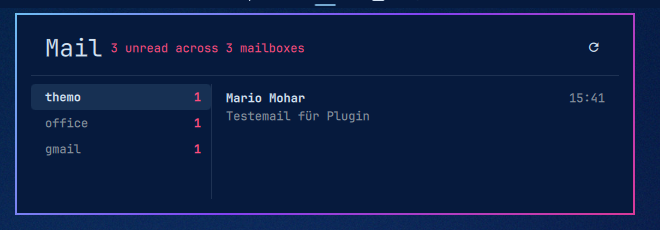

# Mail Inbox — Omarchy bar widget

One bar icon for all your mailboxes: the total unread count. Click it and the
panel lists your mailboxes on the left with their individual counts — pick one
to see its unread mail on the right. Adding a tenth address costs no bar space.

Click a message to read it in full and answer it without leaving the bar.

Straight IMAP, so Gmail (via app password) and any other account go through one
code path. All mailboxes are polled in parallel; one broken account shows an
error next to its name and leaves the others alone.

<p align="center">
  
</p>

## Install

```bash
omarchy plugin add https://github.com/Mario-Mohar/omarchy-mail-inbox --enable
```

Then add the widget to the bar through the Omarchy shell settings, or with
`omarchy plugin enable themo.mail-inbox right`.

Optional, to get the two account commands onto your PATH:

```bash
~/.config/omarchy/plugins/themo.mail-inbox/install
```

The widget does not need that step — it calls the scripts by absolute path.

**Requirements:** Python 3 (standard library only, nothing to pip install) and
`secret-tool` from libsecret for the keyring.

## Setup

```bash
~/.config/omarchy/plugins/themo.mail-inbox/bin/mail-inbox-account add
```

The wizard asks for the sending side too, so replying works right after
setup. Picking a preset settles it without a single question; entering a
server by hand asks three, and answering `n` skips them if you only want to
read. `mail-inbox-account test <id>` prints whether sending is configured.

Server details are written to `~/.config/omarchy/mail-inbox/accounts.json`
(mode 600). The password is stored in the login keyring under the service
`omarchy-mail-inbox` and is never written to that file or passed on a
command line.

For Gmail, create an app password at <https://myaccount.google.com/apppasswords>
(needs 2-step verification enabled). Your normal Google password will not work
over IMAP.

One "Mail Inbox" widget in the bar covers every account — no per-account
setup in the widget itself. New mailboxes appear as soon as `accounts.json`
changes; the widget watches the file.

## Reading and replying

Clicking a message opens it in the right-hand pane: full text, sender, date and
any attachment names, with a reply box underneath. **Ctrl+Enter** sends,
**Escape** goes back to the list (and only closes the panel once the message is
closed, so a stray Escape cannot lose a half-written reply).

Reading never touches the mailbox. `\Seen` is set only by the **Mark read**
button, so the bar counter cannot drop just because you glanced at something.
Sending a reply flags the original `\Answered` and files a copy in the
account's Sent folder.

Replies go out as `text/plain` with the original quoted below, and carry
`In-Reply-To` / `References`, so they thread properly in the recipient's client.
**Reply all** appears only when the message actually has other recipients.

Only the first 256 KB of a message body are fetched — MIME puts the text parts
before the attachments, so this costs nothing in practice and keeps a mail with
a 20 MB attachment from stalling the panel. When it does bite, the panel says
the message was truncated rather than pretending it showed everything.

## Account fields

| Field | Needed for | Example |
|---|---|---|
| `host`, `port`, `user`, `folder` | reading | `imap.gmail.com`, `993` |
| `smtpHost`, `smtpPort`, `smtpMode` | replying | `smtp.gmail.com`, `465`, `ssl` |
| `from` | replying | `you@example.org` |
| `fromName` | optional display name | `Your Name` |
| `sentFolder` | filing sent replies | `Sent`, `[Gmail]/Gesendet` |
| `appendSent` | set `false` for Gmail | Gmail files its own copy |

`smtpMode` is `ssl` (implicit TLS, usually port 465) or `starttls` (usually 587);
the wizard derives it from the port. These fields are filled in for you by
`mail-inbox-account add` — the table is for editing an account that already
exists, or for adding sending to one set up before version 3.3.0.

## Commands

```bash
mail-inbox-setup                  # fill in missing passwords for all mailboxes
mail-inbox-account add            # add a mailbox, interactively
mail-inbox-account list           # show configured ids
mail-inbox-account test <id>      # poll once and print the result
mail-inbox-account remove <id>    # drop it and clear the keyring entry

mail-check --all --limit 12       # unread state of every mailbox, as JSON
mail-read --account <id> --uid N  # one message in full, as JSON
mail-mark --account <id> --uid N --flag seen [--remove]
mail-send < request.json          # the reply request arrives on stdin
```

`mail-send` reads its request from stdin rather than argv: the reply body would
otherwise be readable in `/proc` by every process on the machine, and the rule
that keeps passwords off the command line applies just as much to what you
wrote.

## Opening it without the mouse

The panel registers an IPC target, so it can be opened from a key binding or a
script:

```bash
omarchy shell themo.mail-inbox toggle    # also: open, close, show, hide
omarchy shell themo.mail-inbox refresh   # poll every mailbox now
```

## Widget settings

| Setting | Default | Meaning |
|---|---|---|
| Refresh interval | 300 s | how often the mailboxes are polled |
| Messages in panel | 12 | how many unread messages per mailbox are listed |
| Hide when no unread mail | off | remove the icon while everything is read |

Middle-click or scroll on the icon forces an immediate check. In the panel,
Up/Down switch mailboxes and Enter re-checks.

## Removing it

```bash
~/.config/omarchy/plugins/themo.mail-inbox/uninstall   # undo the PATH links
omarchy plugin remove themo.mail-inbox
```

Two things deliberately survive that, because they are yours and not the
plugin's:

- `~/.config/omarchy/mail-inbox/` — your mailbox list and its backups.
- The keyring entries under the service `omarchy-mail-inbox`. List them with
  `secret-tool search service omarchy-mail-inbox`, remove one with
  `secret-tool clear service omarchy-mail-inbox account <id>`.

## What it touches

Worth knowing before you install any plugin that reads your mail:

- **Network:** IMAP and SMTP to the servers you configure, nothing else. No
  telemetry, no third-party service.
- **Credentials:** read from the login keyring at the moment they are needed and
  passed to Python through the environment, never as a command-line argument and
  never written to disk.
- **Your mailbox:** read-only except for two explicit actions — the **Mark read**
  button setting `\Seen`, and sending a reply, which flags the original
  `\Answered` and appends a copy to your Sent folder.
- **Files:** `~/.config/omarchy/mail-inbox/accounts.json` (mode 600) and its
  backups. Nothing outside that folder, apart from the optional PATH links.

## Limits

Everything the widget reads comes either from a file on disk or off the network,
so both sides are bounded rather than trusted:

| | |
|---|---|
| `accounts.json` | opened with `O_NOFOLLOW`; regular file, your ownership and mode 600 are checked on the same descriptor that is read from, not on the path. At most 256 KB, 50 accounts, 40 fields each. |
| Config writes | created with `O_EXCL` at mode 600 and `fsync`ed before the atomic replace, so there is no window in which the file exists with a wider mode. The directory must be yours and not group- or world-writable. |
| IMAP search | the UID list is counted in one pass and only a bounded tail is kept, so a mailbox with a very large unread count costs the same memory as a small one. |
| Helper output | capped at both ends: the scripts bound every string and list they emit, and the widget discards a response larger than 512 KB instead of parsing it. |
| Stuck helpers | each poll, read and send has a 90 second watchdog that terminates it. |
| Displayed text | every label renders as plain text, and strings that reach the shared bar tooltip are length-limited with angle brackets removed. Mail decides what is in a subject line. |

## Notes

Messages are addressed by UID together with the mailbox's `UIDVALIDITY`, never
by sequence number. A poll landing between the click and the send therefore
cannot redirect a reply onto a different message; if the server rebuilds the
mailbox, the action is refused instead.

A failed poll keeps the last known counts on screen and marks the affected
mailbox with `!` in the panel list, rather than silently showing zero. The
tooltip on the bar icon lists every mailbox with its count or its error.
